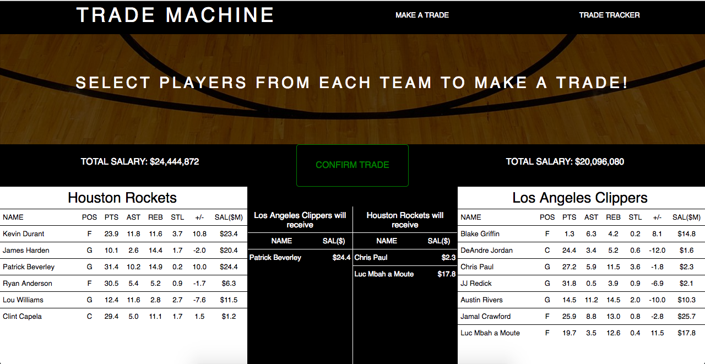

Trade Machine

[LIVE] (http://spurstrademachine.herokuapp.com/#/)

####This Trade Machine allows you to take the reigns of the NBA and trade players between your favorite teams!
####This Trade Machine runs on a Rails backend with a React front end.

##Features
Trade Machine allows a user to pick 2 out of the possible 30 teams in the NBA.<br>


Trade Machine allows a user to trade players between teams where traded salaries is within 150% of each other.<br>


Trade Machine will give a final report upon success of a trade.<br>


Trade Machine contains a trade tracker to view a history of past trades.


##Implementation

The database is seeded with team and player objects. Players are seeded with randomized stats and salaries.
```javascript
hawks = Team.create(
  name: "Atlanta Hawks",
  logo: "http://i.cdn.turner.com/nba/nba/.element/img/1.0/teamsites/logos/teamlogos_500x500/atl.png"
)
atl1 = Player.create(
  team_id: 1,
  name: "Dwight Howard",
  position: "C",
  points: "#{rand(35)}.#{rand(10)}",
  rebounds: "#{rand(15)}.#{rand(10)}",
  assists: "#{rand(12)}.#{rand(10)}",
  steals: "#{rand(4)}.#{rand(10)}",
  plus: "#{rand(26)-13}.#{rand(10)}",
  salary: (rand(25000000) + 1000000)
)
```

Each user can then trade players between each team to his hearts content. Create your own 'superteams' but make sure traded salaries are within 150% of each other!
```javascript
handleTrade(e){
  e.preventDefault();

  if((this.state.team1Salary * 1.5) < this.state.team2Salary ||
    (this.state.team1Salary * 0.5) > this.state.team2Salary){
    this.setState({
      errors: "Traded salaries need to be within 150% of each other!"
    });
  } else if(this.state.team1Salary === 0 || this.state.team2Salary === 0){
      this.setState({
        errors: "Select players to trade!"
    });
  } else {
    let team1 = $.map(this.state.team1Players, function(value, index) {
      return value.name;
    });
    let team2 = $.map(this.state.team2Players, function(value, index) {
      return value.name;
    });

    let trade = {
      team_id: parseInt(this.props.params.team1Id),
      trade_team_id: parseInt(this.props.params.team2Id),
      team_players: team1,
      trade_team_players: team2
    };

    this.props.createTrade(trade)
    .then(trade => this.props.router.push(`/tradesuccess/${trade.id}/${this.props.params.team1Name}/${this.props.params.team2Name}`));
  }
}
```  
Once the user clicks the trade button and submits a trade, this information is sent to the rails backend through an AJAX request and is saved to the database which in turn sends back the trade to the front end as JSON. Upon successful creation of the trade from the backend, we push a new route to the react router and render a success page showing which players went to whom.
